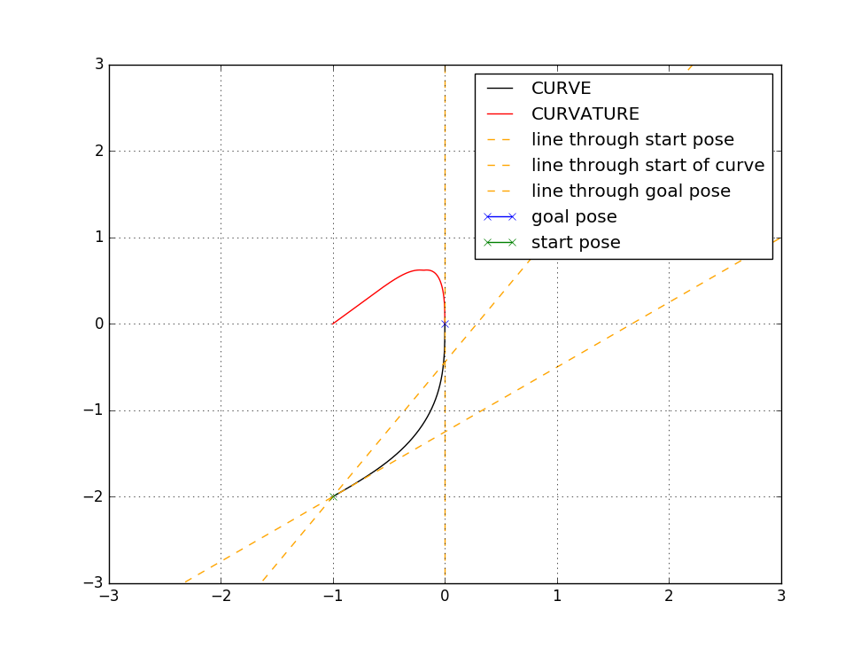
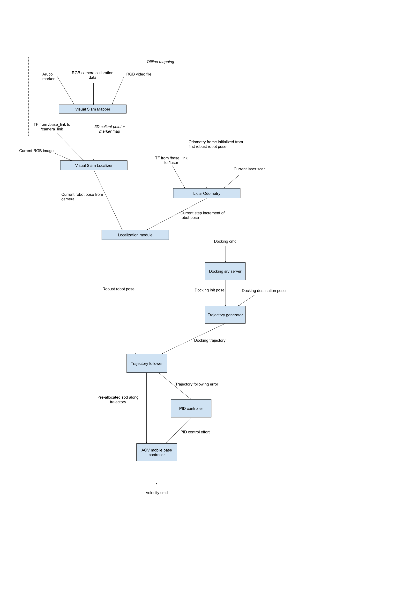

# Docking for mobile robot (PBVS implementation)
This repo contains  ros packages for docking applications of AGVs, such as auto charging  and interface with conveyor belt. Essentially it's a position based visual servoing(PBVS) implementation, thus includes a series of process of localzation in metric map, trajectory planning and trajectory following. It uses UcoSlam (http://www.uco.es/investiga/grupos/ava/node/62) for mapping the docking environment. Together with Aruco marker, it proves to be quite robust to dynamic background. 

Some of the packages are not the work of mine, but are part of the whole solution, so I list them here as reference.

- pid (http://wiki.ros.org/pid)<br />
This package is for PID control of trajectory following part. If only P is used, this package is not necessary, and the control can be realized by simply writing the `control_effort = k_p * error` to where it's required.

- ucoslam-1.0.7 ( https://sourceforge.net/projects/ucoslam/)<br />
This package is based on ORB_SLAM2 and provides useful additional features such as incoporating Aruco marker, ability to save/load map, and easy-to-use GUI tools.

- rf2o_laser_odometry (https://github.com/MAPIRlab/rf2o_laser_odometry)<br />
Since visual SLAM is sensitive to the illumination and environment changing, sometimes in real application scenario, the localization result by UcoSlam is invalid. This package is used as auxillary odometry input when visual SLAM fails, to improve the robustness of localization. 

- smooth_curve_new.py (Cathy Chen chongchen.pku@gmail.com)<br />
This script provides the core function in *trajectory_generation* package, and is the courtesy from a math genius. It provides a cubic curve with continuous curvature given a starting pose and a destination pose in 2-D space.

In real application scenario, less than (**1 cm, 1 degree**) accurary is achieved for the docking task, with multiple people walking around in the scene background.  The robot can start from any initial position that can see the Aruco marker and less than 3m from it. The **3m** range can increase with extending mapping effort.

##  How to use (tested on ubuntu16 & Debian Stretch)

-  Install UcoSlam

	Follow the documentation from http://www.uco.es/investiga/grupos/ava/node/62

-  Install drivers for your RGB and Lidar sensors

	The code in this repo uses d435 for RGB image, but notice that any RGB sensor can be used, such as a cheap web camera. Of course, the performance will increase with higher resolution and frame rate of the sensor. 

	The **driver** folder contains drivers for Sick-tim561 and Hokuyo UST-10LX lidars.

- Get eigen3

	Download eigen3 from http://eigen.tuxfamily.org/index.php?title=Main_Page<br />
	Copy subfolder **Eigen** to **usr/local/include**

- Possible issues

	- *error while loading shared libraries: libucoslam_fbow.so.1.0: cannot open shared object file: No such file or directory*<br />
	Simply run: `sudo ldconfig`

- Work flow

	1. Calibrate camera instrinsics. Extrinsics between camera, lidar and mobile base can either be calibrated with sophisticated algorithm or simply from CAD design model. 

	1. Map the docking environment using UcoSlam, with the calibrated camera. Initialize the mapping at the docking position to use it as the initial point of coordinate system in the generated map. The generated map can be shared between multiple robots.

	1. `roslaunch docking_server docking_server.launch` to launch the *docking_server*<br />
	Call the ROS *dock* service from the initial position where you want to start docking, the docking_server will take care of everything.<br />
	Call *Undock* to back out of the docking position.<br />
	Call *shutdown* to shutdown the docking_server.

## Package function explaination
- docking_server

	It achieves launching and shuting down ROS nodes by *rosservice call*. Because the whole docking function consumes considerable CPU resource, it makes sense to only do the computation during docking and *hibernate* when robot is running other applications.

- localization_module

	It integrates UcoSlam absolute pose and rf2o_laser_odometry to get a robust absolute pose in the map. Due to illumination changes and dynamic environment, camera localization might loses track or jumps drasitically. When camera pose is invalid, use lidar odometry increment to keep tracking until camera pose is valid again. Pseudo code for getting robust robot pose:
```python
function get_robust_pose(last_robust_pose, last_lidar_pose, thredshold):
	get current_camera_pose, current_lidar_pose
	if dis(current_camera_pose, last_robust_pose) > thredshold:
		lidar_pose_increment = current_lidar_pose - last_lidar_pose
		current_robust_pose = last_robust_pose + lidar_pose_increment
	else:
		current_robust_pose = current_camera_pose
	last_robust_pose = current_robust_pose
	last_lidar_pose = current_lidar_pose
```
- trajectory_generation

	Given a start pose and a goal pose, the *generate_curve* rosservice call returns a order-3 trajectory with continuous curvature as the docking path, as shown in the following figure. 
	
	We pursue** continuous curvature **here because this kind of trajectory can gaurantee continuous (linear, angular) speed for a twist robot, which is the canonical velocity command type for AGVs. In contrast, low order trajectory such as piecewise line or arc will cause the robot to *shake* at the connection point of different segment types, because discontinuous curvature causes sudden change of angular speed. 
	
	Given the current robot pose, the *follow_curve* rosservice call returns the trajectory following error (distance and orientation) to the closest point on the generated trajectory for close loop control with PID. 
	
- trajectory_following

	This package implements a PID controller and a state machine for trajecotry following. It uses a simple line trajectory instead of the one generated by the trajectory server to simplify the demonstration of the concept. It would be straightfoward to implement the curve following function using the rosservice call results from *trajectory_generation* package, in a same manner as the *followLine* function in the package. 

## High level information flow of the docking process
